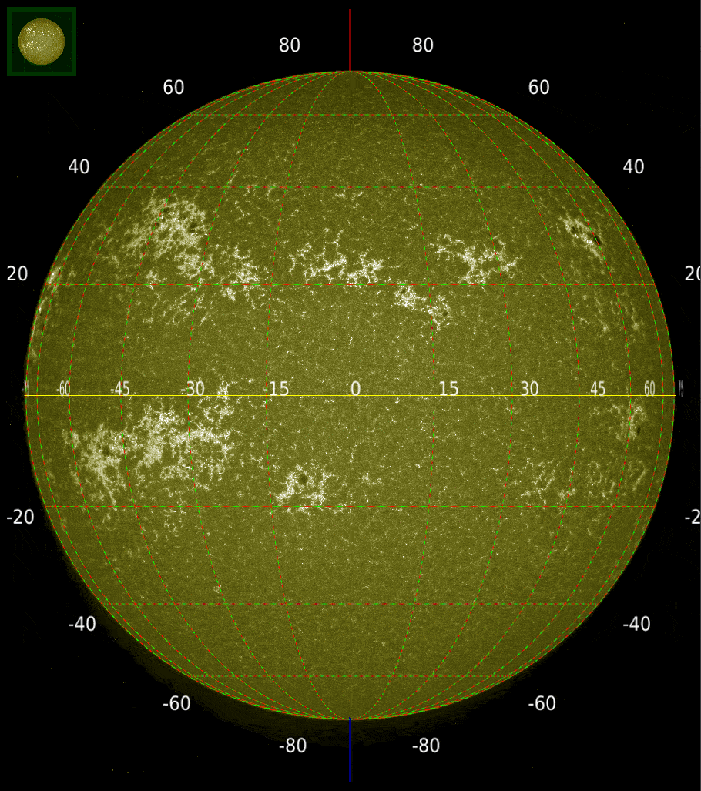

# SUIT ☀️🛰️ P-Angle finding and embedding tool
P-Angle refers to the rotation of the helioprojective coordinate system about the axis passing through the center of the sun, along the direction of observation.
This is necessary to ensure the Helioprojective coordinates point to the solar north in the images.

The rotation of the coordinate system is guided by the `CROTA2` header key in the fits images.
## Authors

- [@janmejoysarkar](https://github.com/janmejoysarkar)
- [@rdiucaa](https://github.com/rdiucaa)
- Srikar Paavan Tadepalli
## Acknowledgements

 - [IUCAA, Pune](https://www.iucaa.in)
 - [ISRO, Aditya-L1](https://www.isro.gov.in/Aditya_L1.html)

## Usage/Examples

Finding the P-angle requires the SPICE kernel files (`data/external/*`), which are consolidated in the meta-kernel file (`data/interim/meta-kernel.txt`).
For all SPICE related operations in the toolkot, calling only the meta-kernel is sufficient, unless otherwise required.

Corrections are to be applied on SUIT Level 1 Data.

### Correcting the P-angle in a given image
Use  `src/rewrite_img.py` to apply P-angle corrections (updating `CROTA2` in the fits header) in the loaded image. Processed images will be saved in `data/processed`.

This process temporarily generates symlinks to image-packet specific `*.bc` and `*.bsp` files in the `data/external` directory. The symlinks are automatically removed after the operation.

### Finding P-Angle (in degrees) for a given UTC
Run `src/find_p_angle.py` to find the P-angle at a given UTC time. The Camera Matrix Kernel (`*.bc`) and Spacecraft Ephemeris Kernel (`*al1*.bsp`) are used from the same packet containing the data.

### Test Cases
- Sun at SUIT CCD Center: Mar 28, Apr 16, Oct 29, Oct 30 2024
- Sun at VELC aligned positions: Mar 12, Apr 16, May 17, Oct 20, Nov 02 2024.

## References
- [Introduction to SPICE Kernels](https://naif.jpl.nasa.gov/pub/naif/toolkit_docs/Tutorials/pdf/individual_docs/12_intro_to_kernels.pdf)
- [SpiceyPy tooklit info](https://spiceypy.readthedocs.io/en/stable/documentation.html)
- Information about the specific SPICE kernel files used in this module can be found in `references/kernel_files_info.xlsx`

## Screenshots

